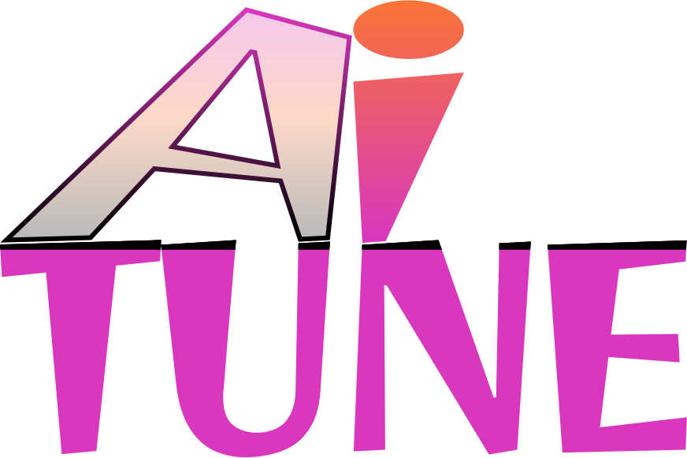

#  — **AI Podcast Platform**

## Introduction

AI-powered SaaS platform designed for users to create, explore, and experience podcasts. It offers advanced capabilities such as text-to-audio transformation with AI-driven multi-voice options, automatic podcast thumbnail generation, and smooth playback.

## Tech Stack

- Next.js
- TypeScript
- Convex
- Clerk
- OpenAI
- Shadcn
- TailwindCSS

## Features

- **Secure Authentication:** A reliable and secure login and registration system.

- **Dynamic Home Page:** Highlights trending podcasts with a persistent player for uninterrupted listening.

- **Podcast Discovery Page:** A dedicated space for users to browse new and trending podcasts.

- **Comprehensive Search Functionality:** Lets users locate podcasts easily with various filters and search options.

- **Podcast Creation Page:** Empowers users to create podcasts using text-to-audio conversion, AI-generated images, and preview features.

- **Multi-Voice AI Support:** Offers multiple AI-generated voice options for engaging and diverse podcast production.

- **User Profile Page:** Displays all created podcasts with options for management and deletion.

- **Podcast Detail Page:** Shows in-depth information on each podcast, including creator profile, listener count, and transcript.

- **Enhanced Podcast Player:** Equipped with controls for skipping, rewinding, and muting/unmuting for a smooth listening experience.

- **Responsive Layout:** Visually optimized and functional across all devices and screen resolutions.

…and much more, including robust code structure for scalability and reusability.

## Installation

Clone the repository and install the project dependencies by running `npm install`

Set Up Environment Variables  
Create a new file named .env in the root of your project and add the following content:

```sh
# Next.js (local)
NEXT_PUBLIC_SERVER_URL=http://localhost:3000

# Convex
CONVEX_DEPLOYMENT=
NEXT_PUBLIC_CONVEX_URL=

# Clerk
NEXT_PUBLIC_CLERK_PUBLISHABLE_KEY=
CLERK_SECRET_KEY=
NEXT_PUBLIC_CLERK_SIGN_IN_URL='/sign-in'
NEXT_PUBLIC_CLERK_SIGN_UP_URL='/sign-up'
CLERK_WEBHOOK_SECRET=

# OpenAI
OPENAI_API_KEY=

# Huggingface
HUGGINGFACE_API_KEY=

# ElevenLabs
ELEVENLABS_API_KEY=
```

Replace the placeholder values with your actual Convex & Clerk credentials.

Run the project using `npm run dev`

## Credits & Attribution

This project was inspired and made with the great mentoring of [JavaScript Mastery](https://www.youtube.com/@javascriptmastery). The tutorial I followed can be found [here](https://youtu.be/zfAb95tJvZQ?si=_bGMt-tP8OBHE1Gx).
